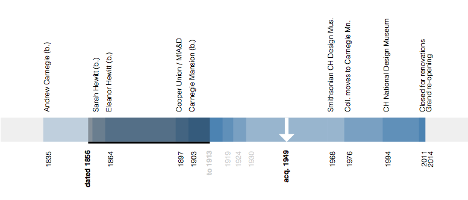
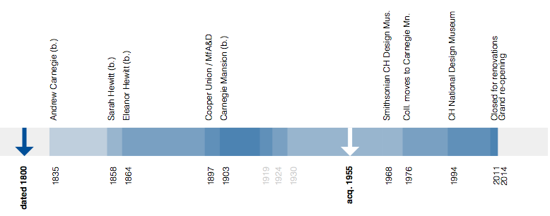
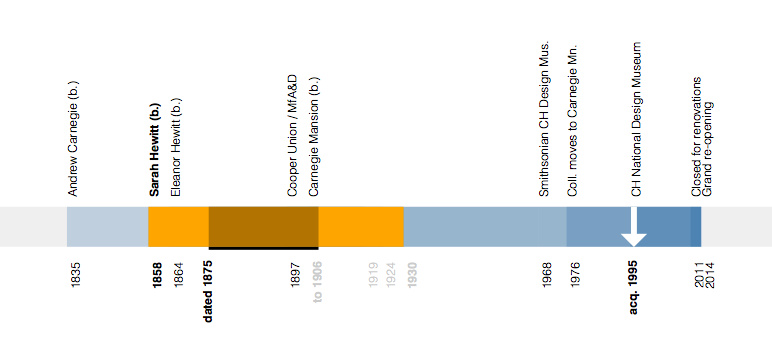

d3-timeline-event-horizon
==

The d3-timeline-event-horizon library is a Javascript library for creating an
interactive visualization depicting when an event occured relative to a
user-defined milestones and using those milestones as a bracketing
device. It piggybacks atop the mighty mighty [D3.js](http://d3js.org/) library.

The timeline's goal is to visualize — and to develop a visual language to represent — an individual event relative to the velocity
of major events that define the larger set of events. Wherever possible the
library will display both the start and end dates for an object represented as its own underlined
event span. If only the start date for an event is know it is indicated that using
a blue arrow.

There is also an `echo` date for an event that is indicated using a white
arrow. For example, the Cooper-Hewitt uses the `echo` date to denote the year in
which an object was acquired in to the permanent collection.

Example
--

First you need to load the necessary Javascript and CSS bits to draw the timeline:

	<link rel="stylesheet" type="text/css" href="css/d3.timeline.event-horizon.css" />
	
	

Then you need to add a `div` element that will contain the timeline. The height
and width of the timeline are derived from the corresponding properties of the
parent `div` element.

	

The you'll need to define the context (a list of events) for the timeline and
optional event that will displayed in that context. Once you've done that simply
create a new `timeline` object and call its `draw` method.

	

Dates for an event can also be prefixed. Like this:

	var event = {
		'start': 1955,
		'end': 1975,
		'echo': 1971,
		'echo_prefix': 'acquired',
		'start_prefix': 'start',
		'end_prefix': '',
	};

You can also add links for events and their context. Links for contextual events
are defined by adding a `link` property. Like this:

	var context = [
		{ 'name': 'Andrew Carnegie', 'start': 1835, 'end': 1919, 'link': '' },
	];

Links for events are defined by defining a `SOMETHING_link` where `SOMETHING` is
either `start`, `end` or `echo`. For example:

	var event = {
		'start': 1955,
		'start_prefix': 'start',
		'start_link': 'http://example.com/year/1955',
	};

Unless you specify otherwise (in your CSS file) the height of the timeline will
be calculated on-the-fly by measuring the length of the item names in your
`context` array as well as years and any prefixes that you've defined. 

The timeline also has a `redraw` method which is pretty much what it sounds like
but needs to invoked explicitly. Here's how you might do it using jQuery:

	$(window).resize(function(){
		tl.redraw();
	});

A couple example is available in the `example` directory.

Notes
--

* Despite the on-the-fly calculation of heights there are still a few hard-coded
  variables. Some due to laziness some due to the part where I'm not entirely
  sure I know what's going on.

* Try to be gentle if you look under the hood. Perhaps this is the optimal way
  to accomplish the functionality we're after with the timeline but somehow I
  doubt it. Elegance of code has been sacrificed in the short-term in favour of
  getting a working demo out the door.

* The library currently assumes the presence of jQuery (a copy of which is
  included in the `lib` directory. This is not a feature and will be fixed
  soon.

* The code that handles label placement could use some help. Some of it could
  probably be abstracted but that sort of optimization felt like a bit of
  yak-shaving during the initial development phase.

* If you look under the hood you might be horrified at what you see. We made a very conscious decision, at this stage of things while we get to know D3, to focus more on the functionality of the timeline itself rather than the elegance of the code. This is a very early experiment and we would be grateful for bug fixes and suggestions for how to make it better.

See also
--

* [The experimental Object Timeline feature on the Cooper-Hewitt collections website](http://collection.cooperhewitt.org/experimental/#tl)

* [D3.js](http://d3js.org/)
